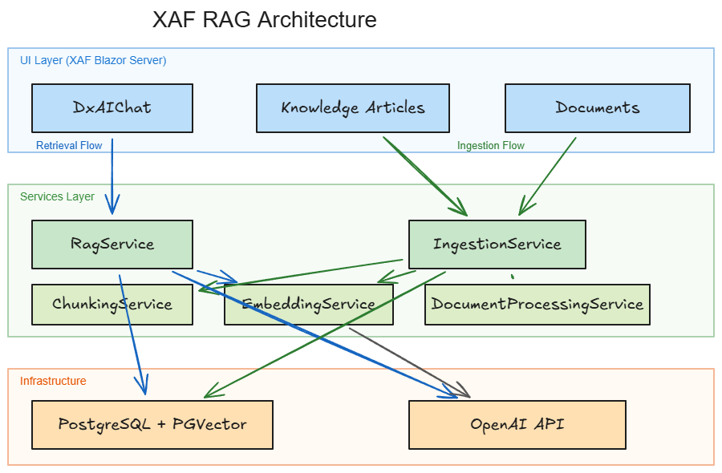

# XafRag — RAG Sample for DevExpress XAF



XafRag is a tutorial and reference implementation showing how to add Retrieval-Augmented Generation (RAG) to a [DevExpress XAF](https://www.devexpress.com/products/net/application_framework/) Blazor Server application. It uses PostgreSQL with the PGVector extension to store and query vector embeddings, OpenAI to generate embeddings and LLM responses, and the DevExpress `DxAIChat` component to provide a polished in-app chat interface — all wired together through `Microsoft.Extensions.AI` abstractions.

---

## Tech Stack

| Layer | Technology |
|---|---|
| Framework | .NET 8, DevExpress XAF 25.2.3 |
| UI | Blazor Server, DevExpress DxAIChat |
| ORM | EF Core 8 (`Npgsql.EntityFrameworkCore.PostgreSQL` 8.0.8) |
| Vector store | PostgreSQL 18 + PGVector (`Pgvector.EntityFrameworkCore` 0.2.2) |
| AI | OpenAI `text-embedding-3-small` (embeddings), `gpt-4o` (chat) |
| AI abstractions | `Microsoft.Extensions.AI` 9.7.1 |
| Document parsing | DevExpress Document Processor (PDF, DOCX) |

---

## Prerequisites

- [.NET 8 SDK](https://dotnet.microsoft.com/download/dotnet/8.0)
- [Docker Desktop](https://www.docker.com/products/docker-desktop/) (for PostgreSQL + PGVector)
- DevExpress license (25.2.x) with the DevExpress NuGet feed configured
- OpenAI API key

---

## Quick Start

1. **Clone the repository**

   ```bash
   git clone https://github.com/your-org/xafrag.git
   cd xafrag
   ```

2. **Start PostgreSQL with PGVector**

   ```bash
   docker compose up -d
   ```

   This starts a `pgvector/pgvector:pg18` container on port 5432 with database `XafRag`.

3. **Set your OpenAI API key**

   ```bash
   # Windows (PowerShell)
   $env:OPENAI_API_KEY = "sk-..."

   # macOS / Linux
   export OPENAI_API_KEY="sk-..."
   ```

4. **Run the application**

   ```bash
   dotnet run --project XafRag/XafRag.Blazor.Server
   ```

   On first run, XAF creates all database tables automatically (including the `knowledge_chunks` vector table).

5. **Log in**

   Open `https://localhost:5001` and log in as **Admin** with an empty password.

6. **Add knowledge**

   Navigate to **Knowledge Base > Knowledge Article** and create one or more articles. Each article is automatically chunked, embedded, and stored in PGVector when saved.

   Alternatively, navigate to **Knowledge Base > Document** and upload a PDF or DOCX file.

7. **Chat**

   Navigate to **Knowledge Base > RAG Chat** and ask questions. The assistant retrieves relevant chunks from your knowledge base before generating a response.

---

## Project Structure

```
xafrag/
├── docker-compose.yml                        # PostgreSQL + PGVector service
├── XafRag/
│   ├── XafRag.Module/
│   │   └── BusinessObjects/
│   │       ├── KnowledgeArticle.cs           # XAF entity (title + content)
│   │       ├── Document.cs                   # XAF entity (file upload)
│   │       ├── RagChatHolder.cs              # Non-persistent object backing the chat view
│   │       ├── KnowledgeChunk.cs             # EF Core entity with vector(1536) column
│   │       ├── RagDbContext.cs               # Separate DbContext for vector operations
│   │       └── XafRagDbContext.cs            # XAF-managed EF Core DbContext
│   └── XafRag.Blazor.Server/
│       ├── Configuration/
│       │   ├── OpenAiOptions.cs              # OpenAI model names
│       │   └── RagOptions.cs                 # Chunk size, overlap, search thresholds
│       ├── Controllers/
│       │   ├── KnowledgeArticleIngestionController.cs
│       │   └── DocumentIngestionController.cs
│       ├── Editors/
│       │   ├── RagChatViewItem.cs            # Custom XAF ViewItem (IComponentContentHolder)
│       │   └── RagChatComponent.razor        # DxAIChat wrapper component
│       ├── Services/
│       │   ├── ChunkingService.cs            # Paragraph-aware text splitter
│       │   ├── EmbeddingService.cs           # Wraps IEmbeddingGenerator
│       │   ├── DocumentProcessingService.cs  # PDF/DOCX text extraction
│       │   ├── IngestionService.cs           # Fire-and-forget ingestion orchestrator
│       │   └── RagService.cs                 # Vector search + LLM response streaming
│       ├── Startup.cs                        # DI wiring
│       └── appsettings.json                  # Configuration
└── docs/
    ├── architecture.png
    └── how_to_implement.md
```

---

## How It Works

### Ingestion pipeline

When a `KnowledgeArticle` is saved (or a `Document` is uploaded), an XAF `ViewController` fires after `ObjectSpace.Committed`. It calls `IngestionService`, which runs the rest of the pipeline on a background thread:

```
Save article / Upload document
  → ChunkingService   — split text into ~500-token paragraphs with 100-token overlap
  → EmbeddingService  — call OpenAI text-embedding-3-small, get float[1536] vectors
  → RagDbContext      — delete old chunks for this source, insert new KnowledgeChunk rows
```

### Retrieval pipeline

When the user sends a message in the RAG Chat view:

```
User question
  → EmbeddingService  — embed the question (same model)
  → RagDbContext      — cosine distance search via PGVector, top 5 results under threshold
  → RagService        — build system prompt with retrieved context
  → OpenAI gpt-4o     — streaming chat response
  → DxAIChat          — render streamed Markdown in the browser
```

---

## Configuration

All configuration lives in `appsettings.json`. The OpenAI API key is intentionally read from an environment variable at startup.

```json
"OpenAI": {
  "EmbeddingModel": "text-embedding-3-small",
  "ChatModel": "gpt-4o"
},
"Rag": {
  "ChunkTokenLimit": 500,
  "ChunkOverlap": 100,
  "MaxResults": 5,
  "DistanceThreshold": 1.0
}
```

| Setting | Description |
|---|---|
| `ChunkTokenLimit` | Maximum estimated tokens per chunk (1 token ≈ 4 characters) |
| `ChunkOverlap` | Overlap in tokens carried from the previous chunk |
| `MaxResults` | Maximum number of chunks returned by vector search |
| `DistanceThreshold` | Cosine distance ceiling — chunks beyond this are excluded |

Set `OPENAI_API_KEY` in your environment or a secrets manager. Do not put the key in `appsettings.json`.

---

## Future Extensions

- **Hybrid search** — combine BM25 full-text search with vector search and re-rank results
- **Query expansion** — generate multiple query variants to improve recall
- **Chat history** — pass previous turns to the LLM for multi-turn conversations
- **Source citations** — surface chunk metadata (article title, document name, page number) in responses
- **Background job queue** — replace fire-and-forget `Task.Run` with Hangfire or a hosted service queue for reliable ingestion at scale
- **Re-ingestion command** — XAF Action to manually trigger re-embedding of an article or document

---

## License

MIT
